# Maintenix

Hệ thống bảo trì dự đoán thông minh cho nhà máy sản xuất công nghiệp — phục vụ 11 nghiệp vụ cốt lõi: Dashboard, Thiết bị, Cảm biến Realtime, Cảnh báo & SLA, Lệnh công việc, Lịch bảo trì, Phụ tùng, AI/ML Dự đoán, Báo cáo & OEE, Người dùng & RBAC, Cài đặt hệ thống.

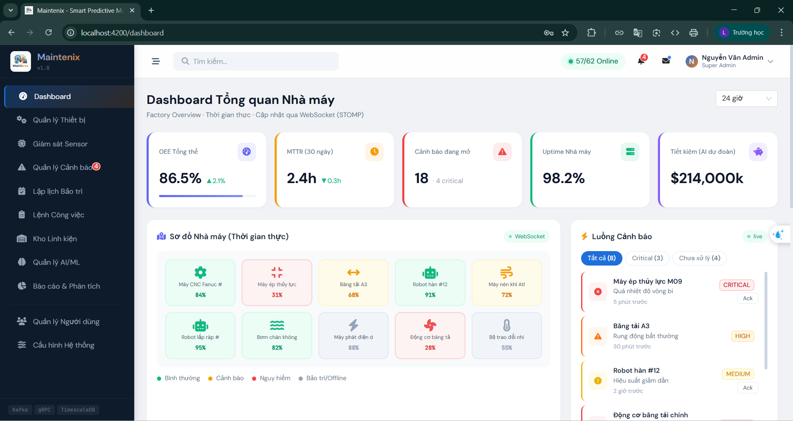 
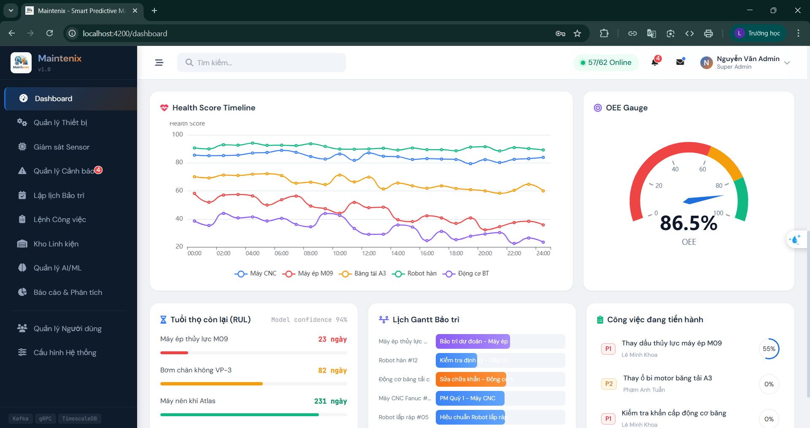 
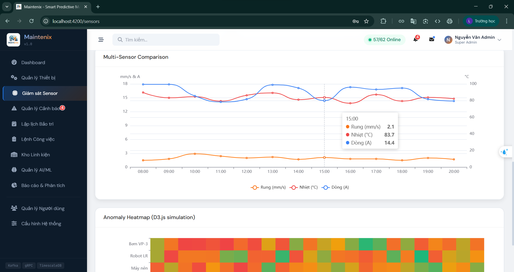 
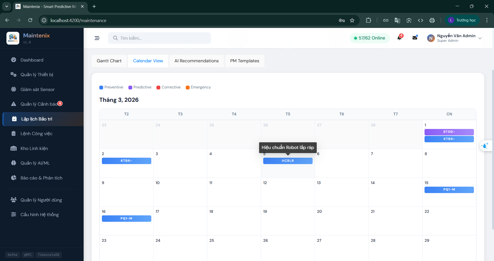 
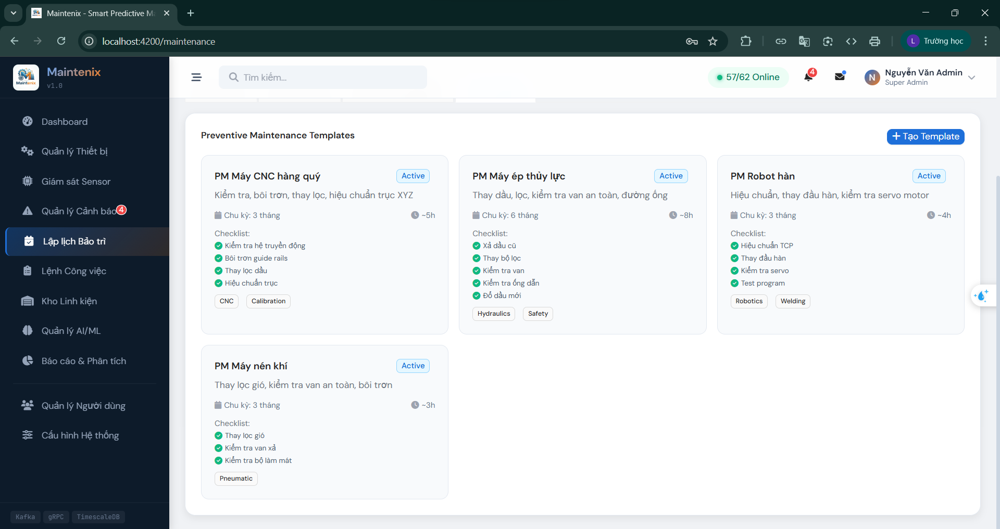 
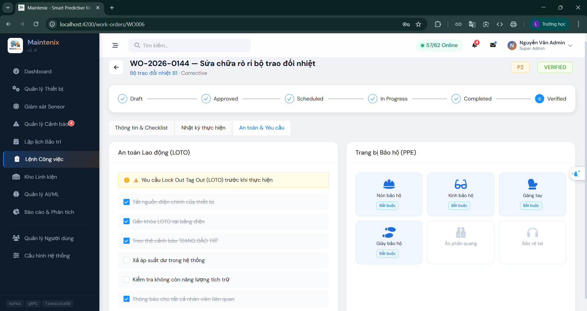 
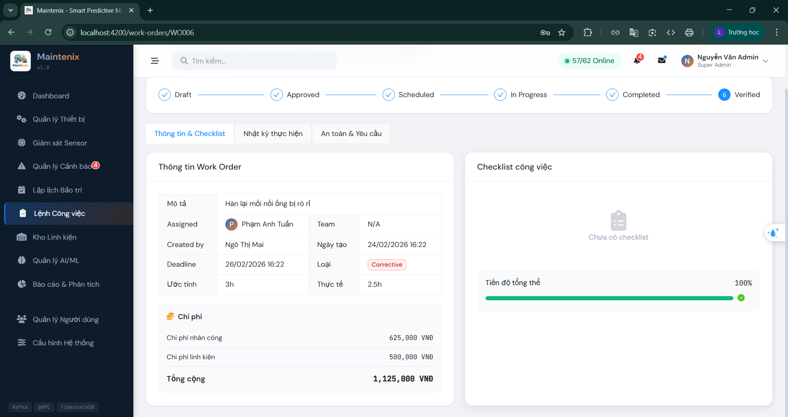 
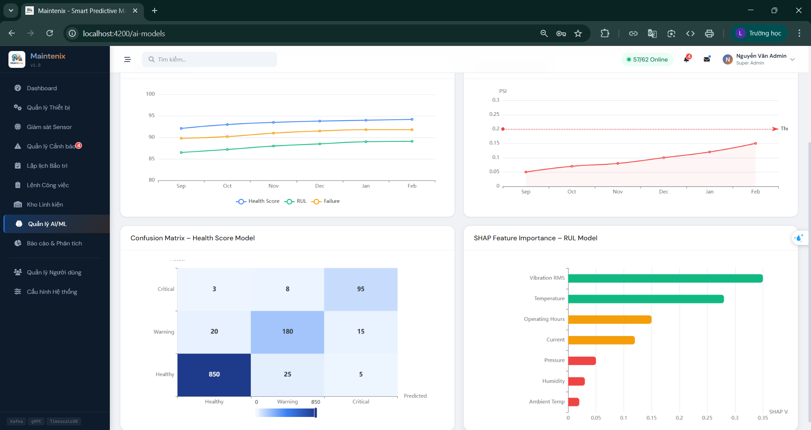 
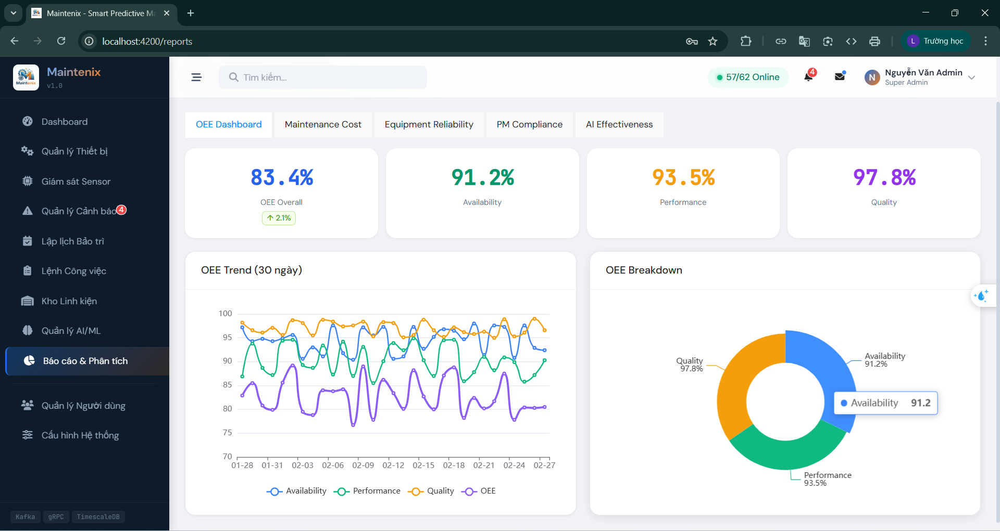 
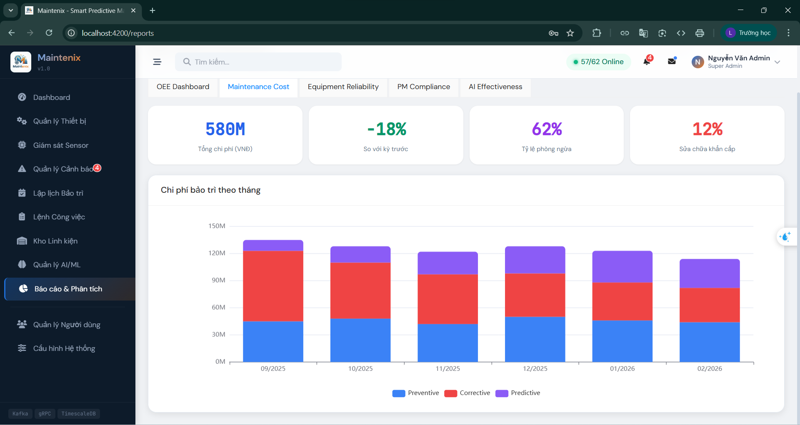 
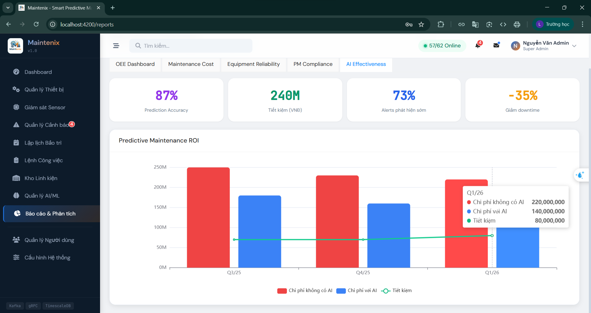 
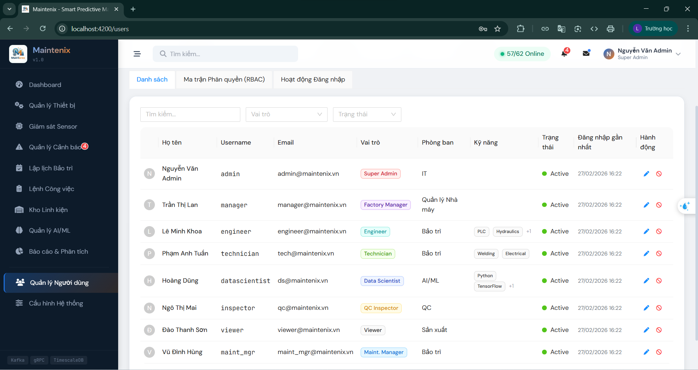 
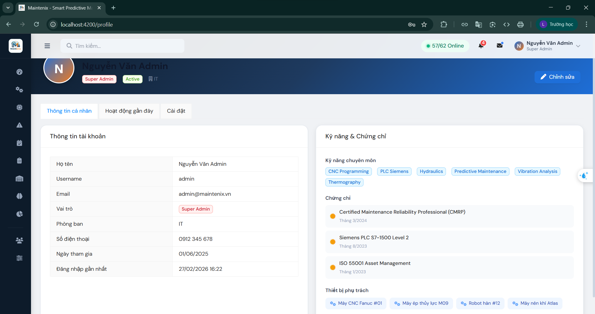 

**Frontend** chạy độc lập bằng mock data, sẵn sàng kết nối **9 microservices** backend chỉ bằng 1 dòng config.

```
Tech Stack
├── Frontend:   Angular 17 · NG-ZORRO (Ant Design) · ECharts · Tailwind CSS · RxJS · TypeScript · SCSS
└── Backend:    Go 1.22+ · Clean Architecture · Nginx API Gateway
                Apache Kafka · Redis · PostgreSQL · TimescaleDB · InfluxDB
                TensorFlow · Kubeflow · SageMaker · Python
                gRPC · WebSocket (STOMP) · OPC-UA · Docker · Kubernetes
                HashiCorp Vault · Casbin · MinIO · Prometheus · Grafana · Jaeger
```

---

## Tài liệu

```
READ FIRST/              Đọc trước khi làm bất cứ việc gì
├── architecture.md        Kiến trúc 9 microservices, quyết định thiết kế ADR, sơ đồ giao tiếp
├── business-flows.md      8 luồng nghiệp vụ chính với sequence diagram chi tiết
└── rbac-matrix.md         3 lớp phân quyền: UI sidebar · API endpoint · data row/column

READ FRONTEND/           Dành cho frontend developer
├── frontend-structure.md  Cây file Angular 17, mapping TypeScript ↔ Go DTO, 8 tài khoản demo
└── mock-data.md           10 thiết bị, 10 cảm biến, 5 cảnh báo, 6 work order, seed data khớp backend

READ BACKEND/            Dành cho backend developer
├── backend-structure.md   9 microservices, ports REST + gRPC, package structure chuẩn Clean Arch
├── api-contracts.md       50+ endpoints REST, pagination, error format, auth header
├── grpc-contracts.md      4 proto files, 10 RPC methods, timeout, circuit breaker config
└── kafka-events.md        11 topics, payload JSON schema, partition strategy, DLQ config

READ DEPLOY/             Dành cho DevOps / người cài đặt
├── docker-compose.md      Toàn bộ hạ tầng 1 file: PostgreSQL + TimescaleDB + InfluxDB + Kafka + Redis + MinIO + Vault
├── coding-conventions.md  Quy tắc code Go · Angular · Python · Git, PR checklist
├── testing-guide.md       Pyramid 70/20/5/5, coverage targets, Testcontainers
├── troubleshooting.md     Debug startup · runtime · distributed tracing · symptom checklist
└── environment-windows.md Cài đặt toàn bộ môi trường trên Windows từ đầu
```

---

## Chạy nhanh (chỉ Frontend)

```bash
cd maintenix-app
npm install
ng serve
```

Mở http://localhost:4200 — đăng nhập bằng username và password `123456`.

**8 tài khoản demo:**

| Username | Role | Trang mặc định |
|---|---|---|
| `admin` | Super Admin | Dashboard tổng quan |
| `manager` | Factory Manager | Dashboard KPI, OEE |
| `maint_mgr` | Maintenance Manager | Work Orders, lịch bảo trì |
| `engineer` | Maintenance Engineer | Cảnh báo, chi tiết thiết bị, AI |
| `technician` | Technician | Work Orders, checklist, phụ tùng |
| `datascientist` | Data Scientist | AI Models, pipelines, reports |
| `inspector` | Quality Inspector | Thiết bị, cảnh báo, reports |
| `viewer` | Viewer (Read-only) | Dashboard (chỉ xem) |

---

## Kết nối Backend

Frontend hiện dùng mock data nội bộ. Khi backend sẵn sàng, kết nối bằng cách:

### 1. Cấu hình URL

Sửa `src/environments/environment.ts`:

```typescript
export const environment = {
  production: false,
  apiBaseUrl: 'http://localhost:8080/api',   // API Gateway
  wsUrl: 'ws://localhost:8080/ws',           // WebSocket STOMP (alerts realtime)
  grpcUrl: 'http://localhost:8081',          // gRPC-Web (sensors, ML)
  kafkaWsProxy: 'ws://localhost:9092',       // Kafka WebSocket proxy
  sentryDsn: '',
  version: '1.0.0'
};
```

### 2. Chuyển ApiService sang HTTP thật

Chỉ cần thay đổi **1 file duy nhất**: `src/app/core/services/api.service.ts`

Thay các `of(MOCK_DATA).pipe(delay(...))` bằng `this.http.get<T>(...)`:

```typescript
// Mock (hiện tại):
getEquipment(): Observable<Equipment[]> {
  return of(MOCK_EQUIPMENT).pipe(delay(400));
}

// Production (khi có backend):
getEquipment(): Observable<Equipment[]> {
  return this.http.get<Equipment[]>(`${environment.apiBaseUrl}/equipment`);
}
```

### 3. Chuyển AuthService sang JWT thật

Sửa `src/app/core/services/auth.service.ts` — thay mock JWT bằng call thực:

```typescript
// Mock (hiện tại):
login(username: string, password: string): Observable<User> {
  const validPassword = MOCK_CREDENTIALS[username];
  // ... logic check local ...
}

// Production:
login(username: string, password: string): Observable<User> {
  return this.http.post<{ user: User; token: string; refreshToken: string }>(
    `${environment.apiBaseUrl}/auth/login`,
    { username, password }
  ).pipe(
    tap(res => {
      localStorage.setItem('maintenix_auth', JSON.stringify(res));
      this.authState.next({ ...res, isAuthenticated: true, loading: false, error: null });
    }),
    map(res => res.user)
  );
}
```

### 4. Kết nối WebSocket STOMP (cảnh báo realtime)

Thay `subscribeAlerts()` bằng STOMP client thật:

```typescript
// Cài: npm install @stomp/rx-stomp rxjs
import { RxStomp } from '@stomp/rx-stomp';

const rxStomp = new RxStomp();
rxStomp.configure({ brokerURL: environment.wsUrl });
rxStomp.activate();

subscribeAlerts(): Observable<Alert> {
  return rxStomp.watch('/topic/factory-alerts').pipe(
    map(msg => JSON.parse(msg.body) as Alert)
  );
}
```

### 5. Kết nối gRPC-Web (sensor streaming)

Thay `streamSensorData()` bằng gRPC-Web client:

```typescript
// Cài: npm install grpc-web google-protobuf
// Proto: api/proto/sensor.proto → generate TypeScript client

streamSensorData(sensorId: string): Observable<SensorReading> {
  return new Observable(observer => {
    const request = new StreamSensorDataRequest();
    request.setSensorId(sensorId);
    const stream = sensorClient.streamSensorData(request, { Authorization: `Bearer ${this.authService.token}` });
    stream.on('data', (reading) => observer.next(reading.toObject()));
    stream.on('error', (err) => observer.error(err));
    stream.on('end', () => observer.complete());
  });
}
```

### 6. Service ↔ Port mapping

| Service | Port | Protocol | Chức năng |
|---|---|---|---|
| api-gateway | 8080 | HTTP | Routing, rate limit, CORS, aggregation |
| auth-service | 8081 | HTTP + gRPC | JWT RS256, RBAC (Casbin), audit logs |
| equipment-service | 8082 | HTTP + gRPC | Equipment CRUD, health score, spare parts |
| sensor-service | 8083 | gRPC + Kafka | Sensor ingestion, time-series query |
| alert-service | 8084 | HTTP + WS + Kafka | Alert CRUD, SLA countdown, WebSocket broadcast |
| workorder-service | 8085 | HTTP | Work orders, checklists, cost tracking |
| ml-service | 8086 | HTTP + gRPC | Model registry, pipelines, RUL prediction |
| notification-service | 8087 | Kafka consumer | Email, SMS, push, Slack/Teams |
| opcua-bridge | 4840 | OPC-UA + Kafka | PLC/SCADA → Kafka ingestion |

### 7. Checklist chuyển đổi

- [ ] Backend 9 services đã chạy (`docker-compose up` — xem `docker-compose.md`)
- [ ] Cập nhật `environment.ts` với URL đúng
- [ ] Thay mock calls trong `api.service.ts` bằng `HttpClient`
- [ ] Thay mock login trong `auth.service.ts` bằng REST call
- [ ] Inject `HttpClientModule` vào `app.config.ts`
- [ ] Thêm HTTP interceptor gắn JWT token vào mọi request
- [ ] Kết nối STOMP WebSocket cho alerts realtime
- [ ] Kết nối gRPC-Web cho sensor streaming & ML predictions
- [ ] Test RBAC: 8 roles × tất cả endpoints
- [ ] Xóa import `MOCK_*` và file `mock-data.ts` khi không còn cần

